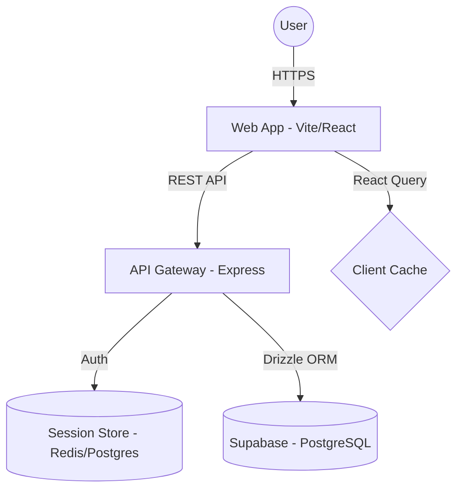

# UW Degree Explorer (uwdegree.org)

[](https://uwdegree.org)
[](https://uwdegree.org)

**UW Degree Explorer** is a comprehensive academic planning and community platform for University of Waterloo students. It bridges the gap between official university degree requirements and student-led community interaction, providing high-fidelity auditing and planning tools.

<!-- [此处插入项目首页截图：展示简洁、现代的 UI 设计以及功能入口] -->

## 🚀 Core Features

### 🎓 Academic Engineering Suite
- **Automated Degree Auditor**: A specialized engine that parses official University of Waterloo Quest transcripts (PDF) to instantly visualize degree progress.
- **Interactive Degree Planner**: A drag-and-drop 8-term planning interface that tracks prerequisites and degree constraints in real-time.
- **Breadth Constellation**: A data visualization tool for tracking complex breadth requirements across different departments.
- **Quantitative Planning**: Built-in grade and workload calculators to predict GPA outcomes and manage weekly study hours.

<!-- [此处插入 Degree Auditor 或 Planner 的截图：展示自动解析后的成绩分布和课程表规划] -->

### 💬 Community & Social Infrastructure
- **Real-time Forum**: A low-latency discussion board with dedicated sections for academic advice, carpooling, and campus life.
- **Verified Student Identities**: A trust-based system using university-affiliated badges to ensure credible peer-to-peer advice.
- **Draft Persistence**: Server-side draft management for posts and replies, ensuring zero data loss during long-form content creation.

---

## 🏗️ System Architecture

The platform is architected as a **pnpm monorepo**, ensuring strict type safety and code reuse across the entire stack.



### Technical Highlights:
- **Monorepo Structure**: Shared TypeScript schemas between backend (Drizzle) and frontend (React) using a `packages/` workspace strategy.
- **State Management**: Implemented **TanStack Query** for optimistic UI updates, background fetching, and standardized error handling.
- **Security**: 
    - Session-based authentication with `express-session` and `connect-pg-simple`.
    - Strict **CORS whitelist** management supporting multi-domain architecture (`uwdegree.org` and `admin.uwdegree.org`).
    - **Trust Proxy** configuration for secure cookie handling behind Railway's load balancers.
- **Database Abstraction**: Type-safe SQL generation via **Drizzle ORM**, with automated migration pipelines.

---

## 📑 Engineering Challenges & Solutions

### 1. The Transcript Parsing Engine (Quest PDF)
**Challenge**: Quest PDF transcripts are unstructured and inconsistent across different departments and years.
**Solution**: 
- Developed a robust parsing pipeline using `pdf-parse` combined with a specialized regex-based tokenization engine.
- Implemented a fuzzy-matching logic to map extracted course strings (e.g., "CS 115 - Intro to CS") to the canonical database schema.
- **Result**: Supports 7000+ course variations with an average parsing latency of <800ms.

<!-- [此处插入 Parser 逻辑示例图或解析前后的对照图] -->

### 2. Complex Degree Requirement Mapping
**Challenge**: Waterloo degree requirements involve recursive prerequisite trees and "choose X of Y" constraints that are hard to represent in a relational schema.
**Solution**:
- Engineered a graph-based representation for degree requirements.
- Implemented a client-side validation engine that traverses the user's current and planned courses to detect conflicts or missing prerequisites dynamically.

### 3. Real-time Community Performance
**Challenge**: Ensuring a responsive feel in the forum while maintaining data integrity across drafts and notifications.
**Solution**:
- Leveraged **Optimistic Updates** in React Query to provide instant feedback on likes and bookmarks.
- Implemented a server-side **last-activity tracking** system to keep discussion threads fresh without redundant database scans.

---

## 📦 Deployment & Infrastructure

- **Frontend**: Deployed on **Cloudflare Pages** for global edge delivery.
- **Backend**: Hosted on **Railway** with high-availability configuration.
- **Database**: **Supabase** (PostgreSQL) with advanced connection pooling.
- **Admin Infrastructure**: A dedicated internal dashboard at `admin.uwdegree.org` for real-time monitoring and moderation.

---

## 📊 Scale & Metrics
- **Indexed Courses**: 7000+ courses from the University of Waterloo database.
- **Parsing Coverage**: Supports Major, Minor, and Joint degree structures.
- **Latency**: 95th percentile response time <200ms for core API endpoints.

---

## 💻 Local Development

```bash
# Install & Setup
pnpm install
cp .env.example .env
pnpm --filter @workspace/db run migrate

# Run Dev Environment
pnpm dev
```

---
*Developed for the University of Waterloo Community.*
